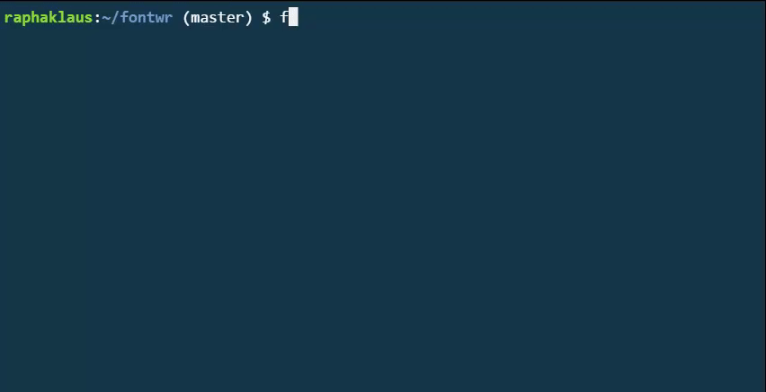
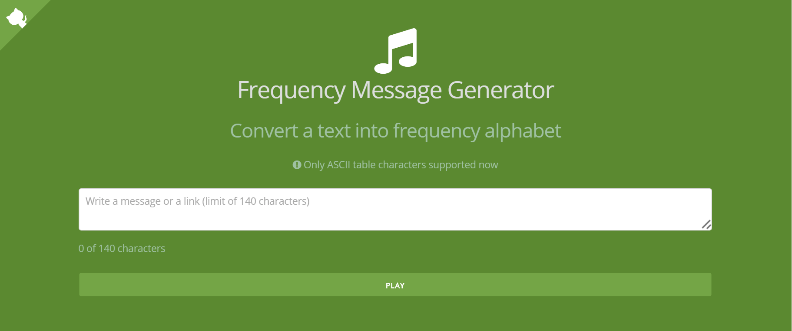
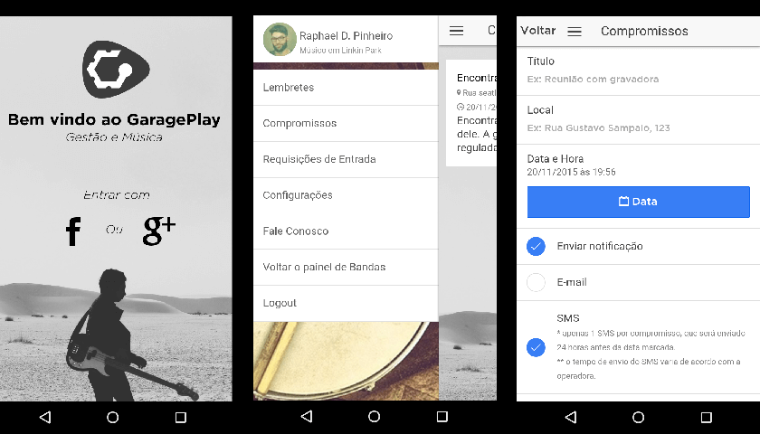
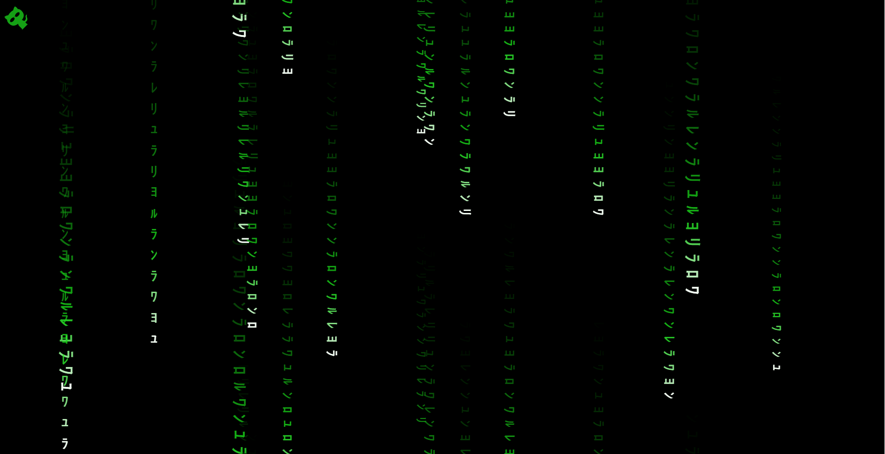

## [Game Boy CPU Emulator](https://github.com/raphaklaus/gameboy-cpu)  
Esse é um trabalho em progresso da emulação da CPU Game Boy (DMG).
Tecnologias: **JavaScript (ES6+), functional**

## [fontwr](https://github.com/raphaklaus/fontwr)  

Gerenciador de fontes (woff2, woff, eot e ttf). Permite baixar mais de 800 fontes, converte-las para qualquer formato e gerar font-faces.
Tecnologia: **NodeJS**

## [Chupa Cabra](https://github.com/raphaklaus/chupa-cabra)  
Linha de comando para copiar conteúdo de websites/APIs paginados.
Tecnologia: **NodeJS**

## [Browser Threshold](https://github.com/raphaklaus/browser-threshold)  
Pequena ferramenta para limitar acesso à sites vindos de browsers antigos como IE <= 10
Tecnologia: **JavaScript**

## [Frequency Message Generator](http://raphaklaus.github.io/frequency-message-generator/)  

Gerador de frequências sonoras através de texto.
Tecnologia: **TimbreJS**

## [GaragePlay App](http://garageplay.net)  

Aplicativo para gestão de músicos e bandas.
Tecnologias: **Ruby on Rails, AngularJS, Ionic Framework**

## [Matrix CSS Effect](http://raphaklaus.github.io/matrix-fx/)  

Efeito Matrix no navegador.
Tecnologia: **CSS3**
